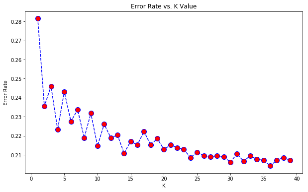

# Customer Churn Prediction in Telecom Sector

Predict behavior to retain customers. You can analyze all relevant customer data and develop focused customer retention programs.

### Data

[IBM Sample Data Sets]

Each row represents a customer, each column contains customer’s attributes described on the column Metadata.
The data set includes information about:
Customers who left within the last month – the column is called Churn Services that each customer has signed up for – phone, multiple lines, internet, online security, online backup, device protection, tech support, and streaming TV and movies Customer account information – how long they’ve been a customer, contract, payment method, paperless billing, monthly charges, and total charges Demographic info about customers – gender, age range, and if they have partners and dependents

### Results

### References

    https://www.kaggle.com/navendush/churn-in-telecom-sector-multiple-models

### Author 
    https://www.linkedin.com/in/navendu-shekhar-32a4765b/
