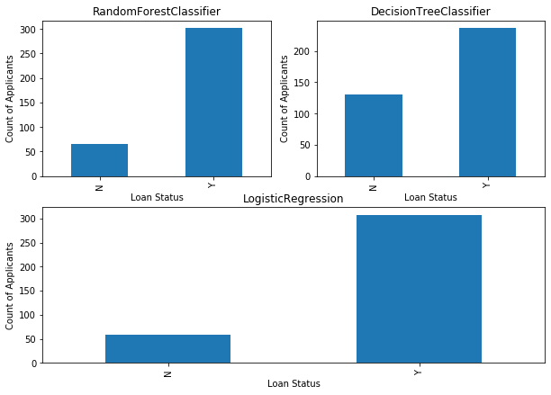

# Credit Loan Status Prediction

We have used logistic regression, DecisionTreeClassifier and RandomForestClassifier for predicting the loan status given user profile comprised of different attributes.

**Data and references**
        https://www.analyticsvidhya.com/blog/2016/01/complete-tutorial-learn-data-science-python-scratch-2/?utm_source=introduction-neural-networks-deep-learning

**Steps Involved:**

-  **Data Cleaning**
-  **Data Exploration**
-  **Data Preprocessing**
-  **Feature Engineering**
-  **Model Training**: Training **TensorFlow**
-  **Conclusions**

`
