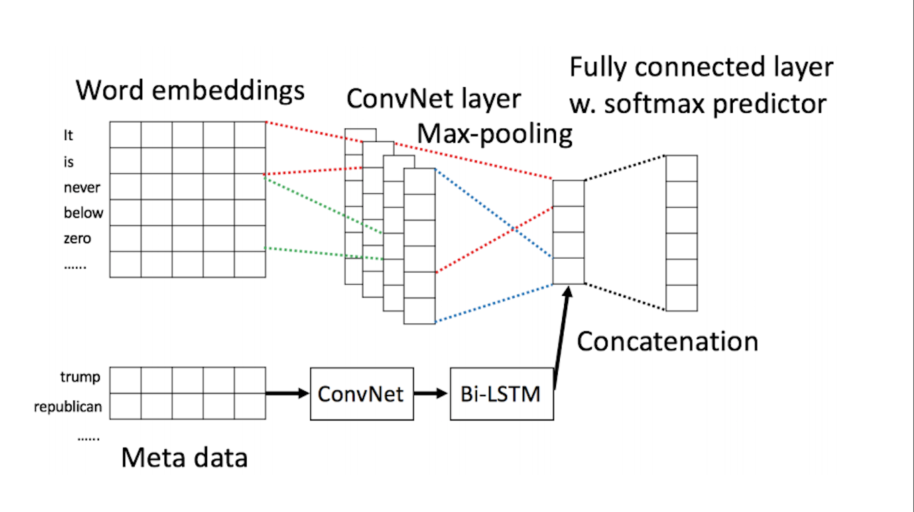

# Fake News Detection

Text classification is always been a hot topic among machine learners. We started this mini project called 
"fake-news-detection", where objective was to predict the target class given a news.

Target Classes:

    ['false', 'half-true', 'mostly-true', 'true', 'barely-true',
           'pants-fire']
         

In internet we have a multiple data sets available on kaggle and other places but pretty much most of the them deal with 
binary classification (target class with two labels). Durring this search we got to know about **`Liar, Liar Pants on Fire`** 
dataset, which is collected by **`Politifact.com`**

Data Set: “Liar, Liar Pants on Fire”: A New Benchmark Dataset for Fake News Detection
    
    https://sites.cs.ucsb.edu/~william/papers/acl2017.pdf
     
    @article{DBLP:journals/corr/Wang17j,
      author    = {William Yang Wang},
      title     = {"Liar, Liar Pants on Fire": {A} New Benchmark Dataset for Fake News
                   Detection},
      journal   = {CoRR},
      volume    = {abs/1705.00648},
      year      = {2017},
      url       = {http://arxiv.org/abs/1705.00648},
      archivePrefix = {arXiv},
      eprint    = {1705.00648},
      timestamp = {Mon, 13 Aug 2018 16:48:58 +0200},
      biburl    = {https://dblp.org/rec/bib/journals/corr/Wang17j},
      bibsource = {dblp computer science bibliography, https://dblp.org}
}

Approach from the Paper:

After reading this research paper and they author has approached the problem motivated us to changing our objective of 
this project to help people approach a text multi class classification problem.

After a lot of brainstorm and great articles on internet, we reached to step wise mind map.

**Mind Map**

`Things to consider?`

- Algorithms will not understand text so we need to look for **`Text Representation`** approach
- Convention methods vs Deep Learning
- Training/Validation/Test same language? embedding? 

**_`Text Representation`_**

    - Bags of Words
    - TFIDF (Term Frequency Inverse Document Frequency)
    - Hashing Vectorization
    - Word2Vec

**Steps Involved:**

- **Preprocessing**
    - Cleaning
    - Steamming
    - Contraction removal
    - Special character removal
- **EDA (Easiest Data Augmentation)** 
    - Word2Vec embedding enrichment
    - Misspelling removal
    - Feature creation

- **Text Representation**
    - Tokenization
    - Text to sequence
    - Padding sequence

- **Modelling** 
    -  Convention models
    - CNN, Bi-LSTM
    
- **Deployment** 

There are two ways to approach the problem on modelling front.

- **Convention Methods (Convention Machine Learning approach)**
    - Logistic Regression
    - Support Vector Machine
    - Navie Bayes Classifier
        
- **Deep Learning Methods**
    - CNN
    - Bi-LSTM
    - Combination of above two ^
   
## References 

Below articles are highly recommended!

https://towardsdatascience.com/a-beginners-guide-to-word-embedding-with-gensim-word2vec-model-5970fa56cc92

https://github.com/tthustla/twitter_sentiment_analysis_part11/blob/master/Capstone_part11.ipynb

https://www.geeksforgeeks.org/python-word-embedding-using-word2vec/

https://towardsdatascience.com/another-twitter-sentiment-analysis-with-python-part-11-cnn-word2vec-41f5e28eda74

https://mlwhiz.com/blog/2019/01/17/deeplearning_nlp_preprocess/

