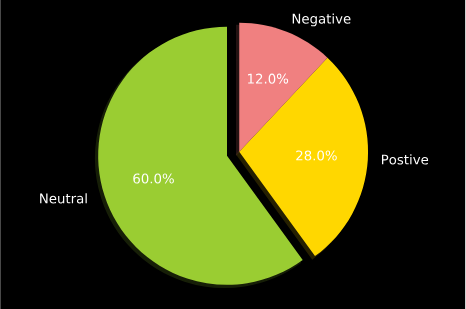

# Sentiment Analysis

We have used TextBlob for sentiment analysis on tweets. Used polarity to figure out text sentiments. 

        # set sentiment 
        if analysis.sentiment.polarity > 0: 
            return 'positive'
        elif analysis.sentiment.polarity == 0: 
            return 'neutral'
        else: 
            return 'negative'

**Data**

    Tweets from Twitter API
    How to generate API tokens? please follow this [link](https://gist.github.com/jimkang/34d16247b40097d8cace)
    

#### References
https://www.geeksforgeeks.org/twitter-sentiment-analysis-using-python/