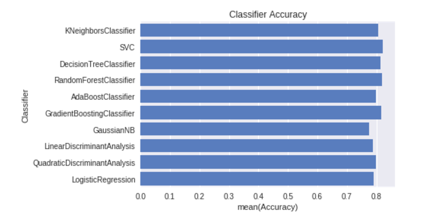

# Titanic: Machine Learning from Disaster

https://www.kaggle.com/c/titanic/overview

Recommended for beginner to go through this [medium article](https://medium.com/@KtheAgent/play-with-data-2a5db35b279c) to understand the context well. 
Objective of this exercise is to help beginner's understanding how to approach a binary classification problem.

## Data Set:

[Kaggle Data Set](https://www.kaggle.com/c/titanic/data)

## Results

## References
- Thanks Kaggle for the [comptition](https://www.kaggle.com/c/titanic/data) and Kaggle notebok for a great learning experience

